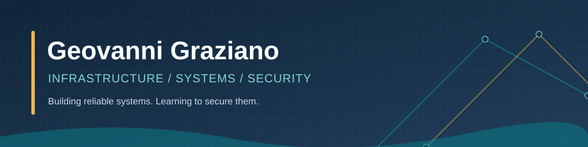

  

  

    
    
    
  

### About me

I'm a **Cyber Threat Intelligence & Defense** student at **Johnson & Wales University**, interested in **systems administration, infrastructure engineering, and cybersecurity**. I enjoy learning how systems communicate, how to keep them reliable, and how to secure them.

Currently building experience with **Linux, networking, Docker, virtualization, and automation** through coursework and hands-on projects.

### Tools & technologies

**Infrastructure & systems**

**Programming & scripting**

### Featured projects

<table>
  <thead>
    <tr>
      <th>Project</th>
      <th>Focus</th>
      <th>Status</th>
    </tr>
  </thead>
  <tbody>
    <tr>
      <td><a href="https://github.com/2bl3/Dockerized_Client-Server-System" target="_blank" rel="noopener noreferrer"><b>Dockerized Client-Server System</b></a></td>
      <td>Python TCP sockets, concurrent requests, Docker, latency measurement</td>
      <td>Completed group project</td>
    </tr>
    <tr>
      <td><a href="https://github.com/2bl3/AI-Data-Processing-Pipeline" target="_blank" rel="noopener noreferrer"><b>AI Data Processing Pipeline</b></a></td>
      <td>Distributed systems and AI-oriented data processing</td>
      <td>In progress</td>
    </tr>
    <tr>
      <td><a href="https://github.com/2bl3/cybersecurity-labs" target="_blank" rel="noopener noreferrer"><b>Cybersecurity Labs</b></a></td>
      <td>Hands-on networking and security exercises</td>
      <td>Ongoing</td>
    </tr>
  </tbody>
</table>

### What I'm working toward

- Deepening my **Linux and Windows systems administration** skills
- Building practical experience with **virtualization, cloud infrastructure, and automation**
- Applying security fundamentals to **real-world infrastructure**
- Exploring **Summer 2027 internships** in infrastructure, IT, and cybersecurity
